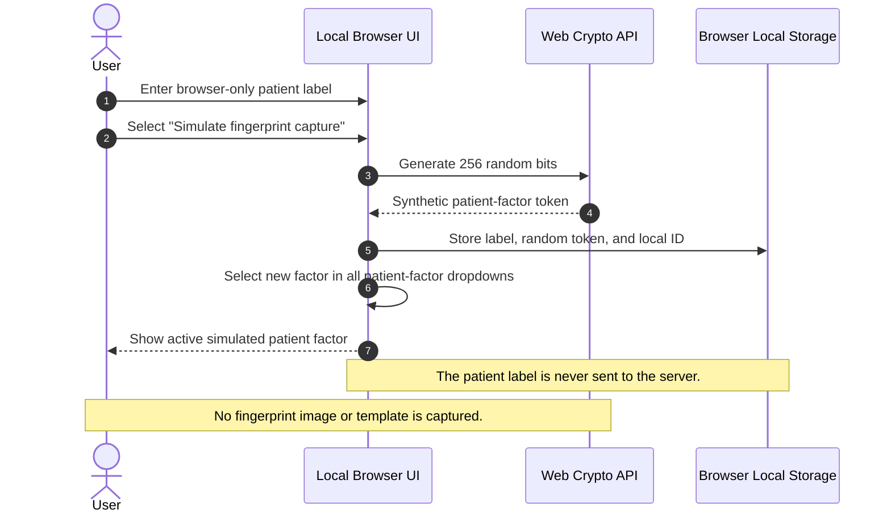
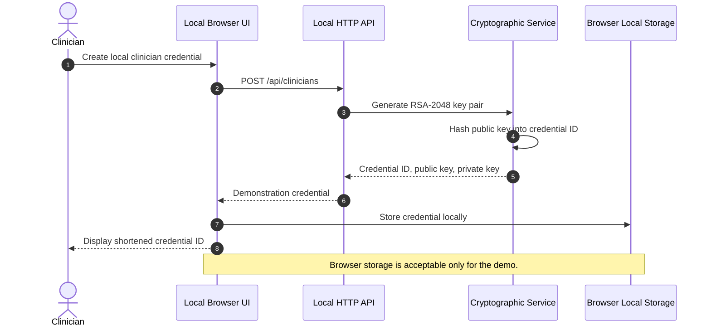
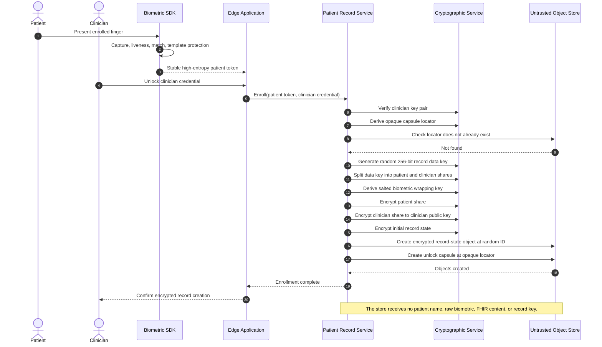
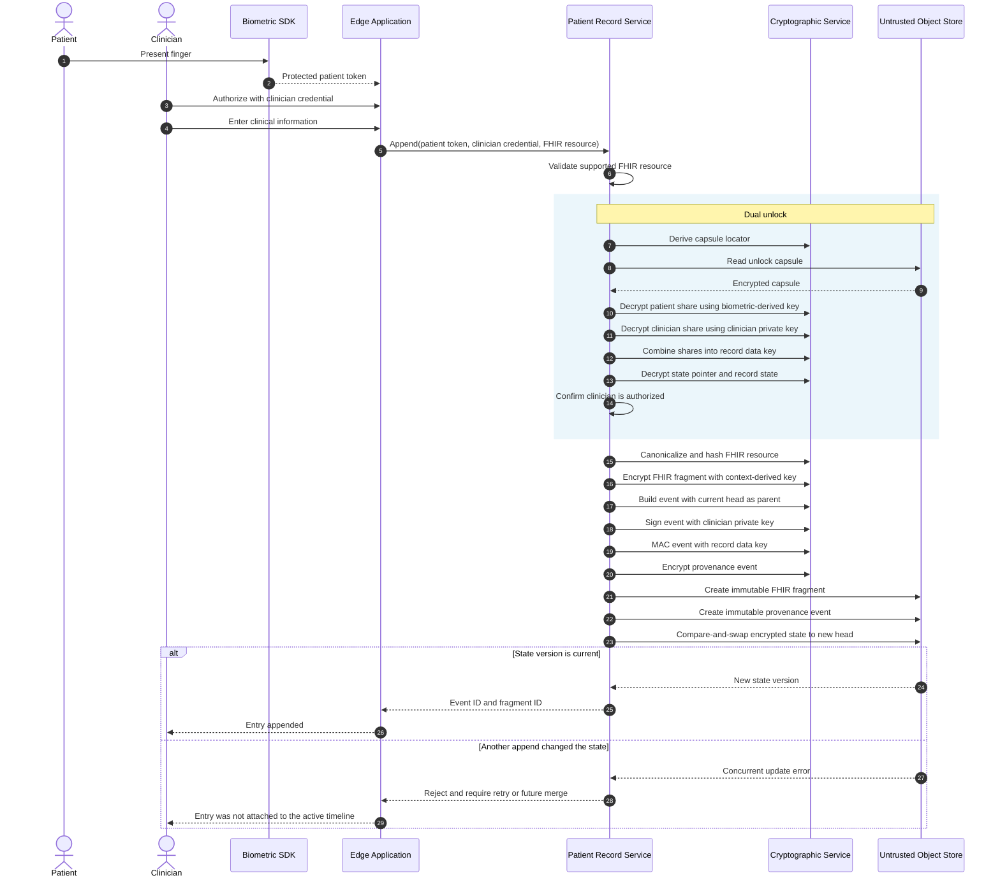
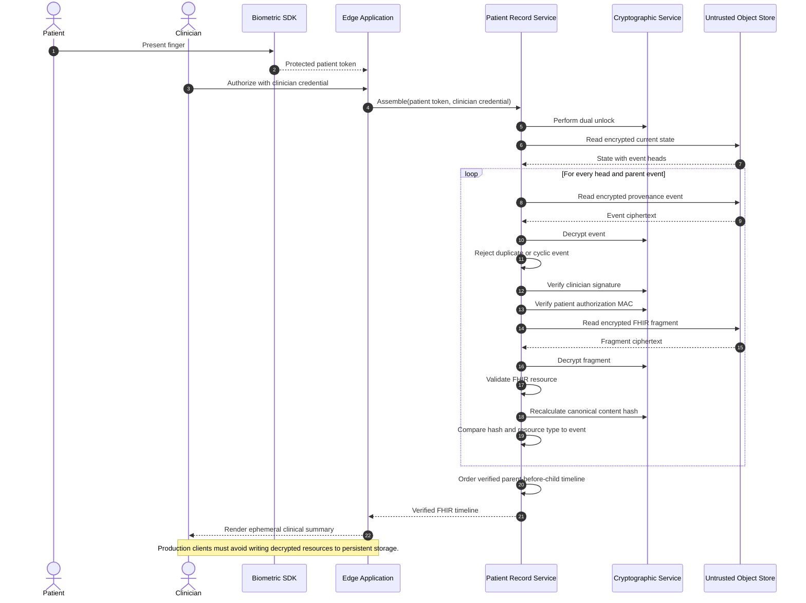
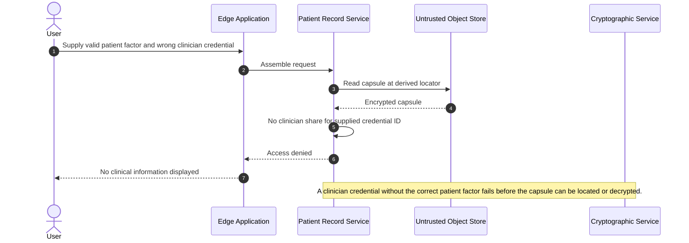
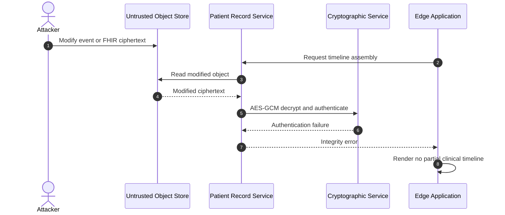
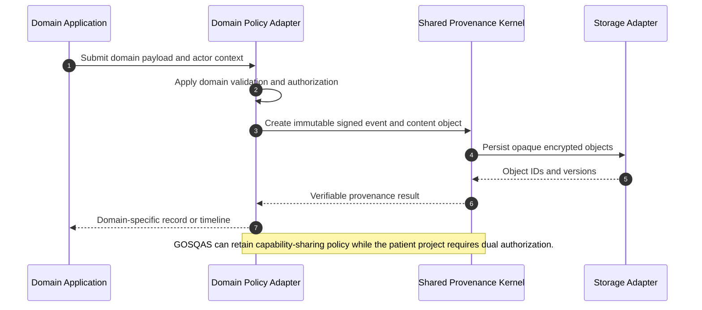

# Global Patient Record Project Sequence Flows

This document describes the proof-of-concept runtime interactions. The
diagrams use Mermaid syntax and render directly in GitHub.

## Participants and trust boundaries

| Participant | Trust assumption |
| --- | --- |
| Patient | Provides physical presence through a future biometric capture flow. |
| Biometric SDK | Trusted to perform capture, liveness, matching, and protected token generation. Simulated in the current browser demo. |
| Clinician | Holds an authorized signing/decryption credential. |
| Edge application | Trusted while unlocked; must avoid persistent cleartext, logs, crash dumps, and swap leakage. |
| Patient record service | Orchestrates cryptography, validation, provenance, and storage. |
| Object store | Untrusted for confidentiality and integrity; trusted only to return bytes and provide basic availability. |

## 1. Patient-factor simulation in the local demo

The browser demo does not process a fingerprint. It generates a random
high-entropy token to stand in for the protected output of a biometric SDK.



## 2. Clinician credential creation

The POC generates a local RSA key pair. Production credential issuance would
require institutional enrollment, secure hardware, rotation, and revocation.



## 3. Patient enrollment

Enrollment creates a random record data key, splits it into patient and
clinician shares, and stores only encrypted state.



## 4. Append an encrypted FHIR entry

Every append requires both factors, creates immutable objects, and advances the
encrypted record head using compare-and-swap.



## 5. Unlock and verify a patient timeline

The system does not return a partially verified timeline. Every reachable event
and fragment must pass integrity checks before the result is presented.



## 6. Access denied with only one valid factor

The record is not unlocked if either side is missing or incorrect.



## 7. Tampered storage object

AES-GCM authentication and event-level verification make modification
detectable.



## 8. Future offline branch and merge

This is a proposed flow, not implemented in the current POC.

```mermaid
sequenceDiagram
    autonumber
    participant ClinicA as Offline Clinic A
    participant ClinicB as Offline Clinic B
    participant Store as Distributed Object Store
    participant Merge as Merge and Verification Service

    ClinicA->>ClinicA: Append event A from common parent P
    ClinicB->>ClinicB: Append event B from common parent P
    ClinicA->>Store: Sync encrypted fragment A and event A
    ClinicB->>Store: Sync encrypted fragment B and event B
    Store-->>Merge: State has heads A and B
    Merge->>Merge: Verify both branches independently
    Merge->>Merge: Apply deterministic ordering and conflict policy
    Merge->>Store: Append merge event M with parents A and B
    Store-->>ClinicA: Updated head M
    Store-->>ClinicB: Updated head M

    Note over ClinicA,Merge: Clinical conflicts must be surfaced; merge must not silently choose one medical assertion.
```

## 9. Potential GOSQAS interoperability boundary

This proposed boundary allows the projects to share provenance infrastructure
without forcing identical access policies.



## Implementation references

- Enrollment, append, unlock, and assembly:
  `src/service/patient-record-service.ts`
- Cryptographic primitives: `src/crypto/primitives.ts`
- Provenance types: `src/domain/provenance.ts`
- Storage abstraction: `src/storage/blob-store.ts`
- Local API: `src/web/server.ts`
- Browser biometric simulation and workflow: `web/app.js`
- Security assumptions: `docs/THREAT_MODEL.md`
- GOSQAS relationship and reuse analysis: `docs/README.md`
