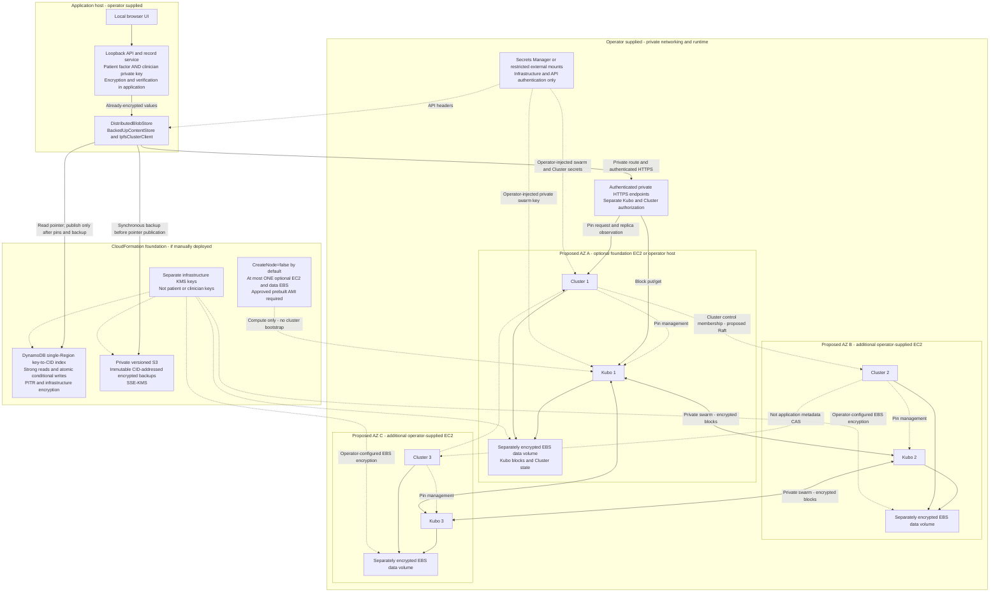
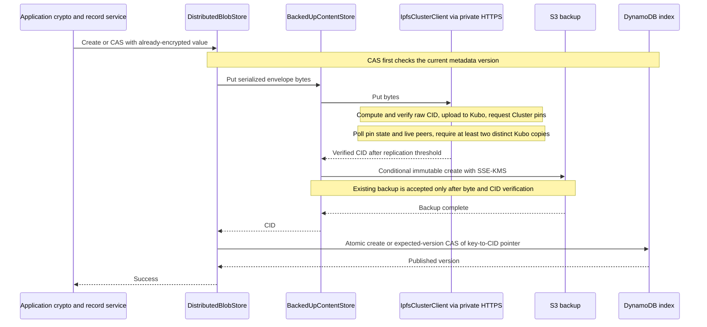
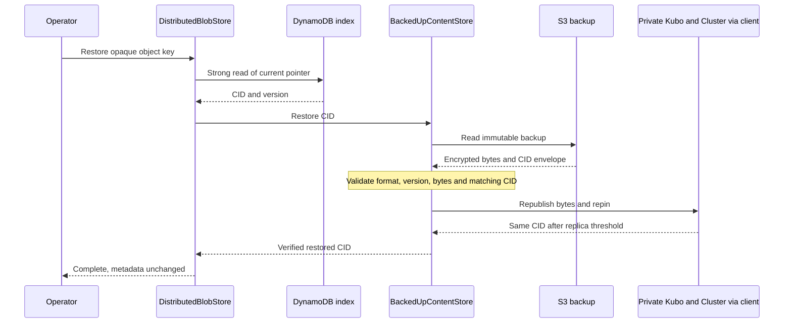
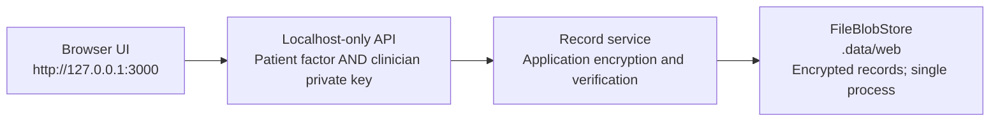
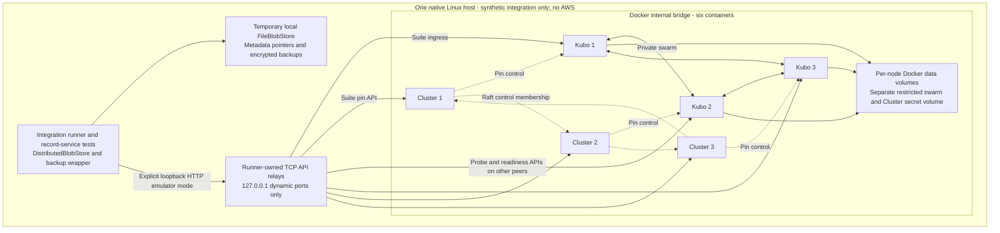

# Storage topology diagrams

**Global Patient Record Project — synthetic-only research POC.** These diagrams
describe the implemented storage composition and a **proposed** AWS deployment,
not a deployed system or a clinical, regulatory, or production-readiness claim.
Azure deployment: **To be decided**; an adapter exists, but no Azure topology is
selected here.

**Legend:** solid arrows show calls/data movement; dotted arrows show control,
credentials, or infrastructure encryption. Subgraph labels distinguish
CloudFormation resources from operator-supplied deployment prerequisites.
CID means content identifier; CAS means compare-and-swap. All persisted record
content is application-encrypted; storage adapters do not perform dual unlock.

## AWS: proposed private three-peer deployment

- The three nodes/AZs are a **proposal**, not stack-created replicas. The
  [foundation template](../infra/aws/storage-foundation.json) provisions storage
  and at most one optional node. The operator supplies additional peers, private
  routes/SG rules, service endpoints, DNS/TLS/authenticated proxies, approved AMI,
  secret injection, swarm configuration and monitoring. Repeat node-secret
  provisioning for every peer; peer identities must be distinct.
- The app may run on the approved EC2 host or on a local host with reviewed
  private connectivity, API credentials and scoped AWS identity. The current web
  server remains loopback-only; this is **not** an internet-facing app deployment.
  The foundation role trusts EC2; a local/other host needs its own reviewed
  identity. No GitHub credentials belong in runtime secret mounts or configuration.
- Cluster places pins among distinct Kubo peers. Success requires observing at
  least **two** live, distinct Kubo identities reporting pinned content (sample
  maximum: three). This observation is not a continuing durability guarantee.
  Raft, if selected by the operator, concerns Cluster control state/membership,
  **not** the application's CAS; DynamoDB supplies that authority.
- A single EC2/EBS node remains a single point of failure and cannot satisfy the
  remote two-copy policy alone. Even the proposed topology retains ingress,
  metadata, AWS account/IAM and KMS dependencies; automatic API failover is not
  implemented. A private swarm alone does not establish independently governed
  decentralized durability. Operators still see CIDs, sizes, placement and timing.
- KMS adds infrastructure encryption; it never replaces patient/clinician
  factors or receives the reconstructed record key. External secrets contain
  infrastructure/API material, not patient factors or plaintext records.

Implementation: [IPFS provider](../src/storage/adapters/ipfs/provider.ts),
[client](../src/storage/adapters/ipfs/ipfs-cluster-client.ts),
[DynamoDB adapter](../src/storage/adapters/dynamodb/dynamodb-blob-store.ts),
[S3 adapter](../src/storage/adapters/s3/s3-blob-store.ts).
Deployment details: [AWS runbook](AWS_HYBRID_STORAGE.md),
[runtime samples](../infra/aws/runtime), and
[nonsecret configuration](../examples/config/aws-hybrid.env.example).

## Write ordering: replicated content, backup, then index

No pointer publication occurs if replication or backup fails. A lost CAS can
leave unreachable blocks/backups; no automatic unpin/delete occurs. A timeout
can have an ambiguous outcome, so reconcile before retrying. This is ordered
publication, not a transaction spanning IPFS, S3 and DynamoDB.
Sources: [distributed store](../src/storage/adapters/ipfs/distributed-blob-store.ts)
and [backup wrapper](../src/storage/adapters/ipfs/backed-up-content-store.ts).

## Explicit restore: never an invisible read fallback

Ordinary reads use the index and primary Kubo bytes with CID verification;
primary failure is surfaced, not silently replaced with S3. Restore the metadata
index separately first if it is lost. Concurrent pointer changes can require
another recovery pass; content restore cannot recover lost factors or establish
snapshot freshness. See [recovery guidance](AWS_HYBRID_STORAGE.md).

## Local default: no IPFS, Docker or cloud required

With dependencies installed and no backend override, `npm start` runs this path:

This is a single-host demonstration, not a distributed durability test. Existing
`.data/web` data is not automatically migrated when another backend is selected.
Sources: [web server](../src/web/server.ts) and
[file provider](../src/storage/adapters/file/provider.ts).

## Optional local private-IPFS integration fixture

`npm run test:integration:ipfs` is a **separate native Linux Docker** test path,
not part of `npm start`. Docker Desktop and remote Docker daemons are unsupported.

The runner owns six API relays; no Docker host ports, public gateways or swarm
ports are published. APIs are unauthenticated for an isolated development host,
not safe for a shared untrusted machine. Only image pulls need internet access;
the running fixture stays on its internal bridge. Metadata/backups use temporary
local files, never AWS. Cluster state also persists in per-node Docker volumes.

The suite exercises synthetic records and CID-verified restore. A separate
node-loss probe first confirms a synthetic block on **all three** Kubo peers,
then stops Kubo 1/Cluster 1 and checks the same bytes through Kubo 2. This is not
automatic ingress failover or proof of host/region failure tolerance: all peers,
metadata and backups still share one host. See the
[fixture contract](../test/fixtures/ipfs/README.md) and
[runner](../scripts/run-ipfs-integration.ts).

## Azure: To be decided

The Azure adapter does not select an Azure deployment architecture. Hosting,
networking, identity, metadata placement and recovery topology are intentionally
undefined here; no cross-cloud mirroring is implied.
